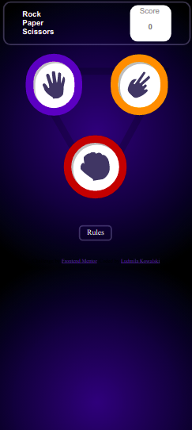
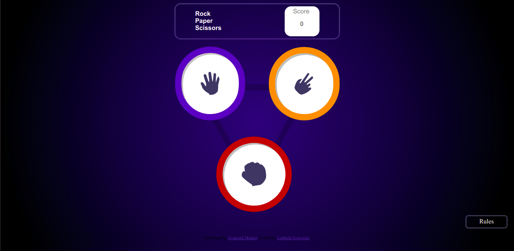

# Frontend Mentor - Rock, Paper, Scissors solution

This is a solution to the [Rock, Paper, Scissors challenge on Frontend Mentor](https://www.frontendmentor.io/challenges/rock-paper-scissors-game-pTgwgvgH). Frontend Mentor challenges help you improve your coding skills by building realistic projects. 

## Table of contents

- [Overview](#overview)
  - [The challenge](#the-challenge)
  - [Screenshot](#screenshot)
  - [Links](#links)
- [My process](#my-process)
  - [Built with](#built-with)
  - [What I learned](#what-i-learned)
  - [Continued development](#continued-development)
  - [Useful resources](#useful-resources)
- [Author](#author)
- [Acknowledgments](#acknowledgments)


## Overview

### The challenge

Users should be able to:

- View the optimal layout for the game depending on their device's screen size
- Play Rock, Paper, Scissors against the computer
- Maintain the state of the score after refreshing the browser _(optional)_


### Screenshot






### Links

- Solution URL: [Solution](https://github.com/LudmilaKowalski/Rock)
- Live Site URL: [Site](https://ludmilakowalski.github.io/Rock/)

## My process

### Built with

- Semantic HTML5 markup
- CSS custom properties
- Flexbox
- Javascript


### What I learned

Use this section to recap over some of your major learnings while working through this project. Writing these out and providing code samples of areas you want to highlight is a great way to reinforce your own knowledge.

To see how you can add code snippets, see below:

```html
 <a style="z-index: 3;" href="./Page2.html" >  </a>
```
```css
.sci2 .show {
    visibility: visible;
    -webkit-animation: fadeIn 1s;
    animation: fadeIn 1s
  }
```
```js
function func() {
  let pap2= document.getElementById("pap2");
  pap2.classList.toggle("show");
}
```


### Continued development

I wanna continue to train myself on mobil first developpement and javascript in general.


### Useful resources

- [Example resource 1](https://www.loginradius.com/blog/async/animating-simple-css-popup-tutorial/) - This helped me to create pop up for the rules.
- [Example resource 2](https://cssgradient.io/) - This is site help me to do the background.


## Author

- Website - [Ludmila Kowalski](https://ludmilakowalski.github.io/Portfolio/")
- Frontend Mentor - [@ludmilakowalski](https://www.frontendmentor.io/profile/LudmilaKowalski)


## Acknowledgments


My best advice its : work mobile first ! I din't do that in my first version and I had to work a lot to make my website suitable for phone. 

Don't hesitate to ask about the animations for the rules display part.

I personally added some small details (highlighting of the buttons when hovering over them). This makes the site more lively and personalizes it a bit. I think it's a good thing.

I personally added some small details (highlighting of the buttons when hovering over them). This makes the site more lively and personalizes it a bit. I think it's a good thing.

